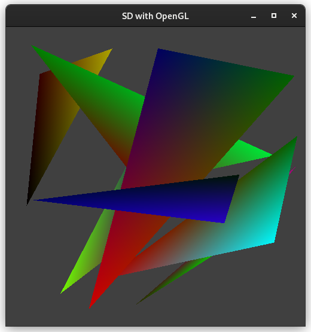

# Open GL

 - trying out some Open GL code
 - To run open gl cpp file : g++ file.cpp -lglut -lGL -lGLU -lGLEW

## mouse pattern with center

## square pattern

## Rectangle

## Triangle

## Geometric

## Keyboard - color

## Line-segments

## Paint

## Points

